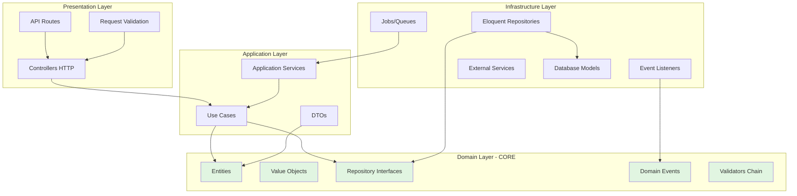

# Candidacy Management API

[](https://laravel.com)
[](https://php.net)
[](#testing)
[](https://github.com/CristianLopez29/manage-applications-and-evaluators)

> Modular and scalable system for managing candidacies and evaluators, implemented with **Hexagonal Architecture**, **advanced design patterns**, and **software best practices**.

---

## 🎯 Architectural Decisions

### Hexagonal Architecture (Clean Architecture)

**Hexagonal Architecture** (also known as Ports and Adapters) was chosen for the following reasons:

#### ✅ **Total Framework Decoupling**
- Business logic (`Domain`) has no Laravel dependencies
- Use cases (`Application`) are framework-agnostic
- Infrastructure (`Infrastructure`) is completely interchangeable
- **Benefit:** I can replace Laravel with Symfony without touching business logic

#### ✅ **Superior Testability**
- 91 tests passing with 353 assertions (comprehensive coverage)
- Unit tests do not require the framework
- Fakes and mocks are trivial to implement
- **Benefit:** Fast and reliable tests

#### ✅ **Long-Term Maintainability**
- Clear separation of responsibilities
- Each layer has a specific purpose
- Changes in UI/DB do not affect business logic
- **Benefit:** Code that ages well

#### ✅ **Team Scalability**
- Teams can work on independent layers
- Clear interfaces between layers
- Easier onboarding with predictable structure
- **Benefit:** Frictionless team growth

### Decision: Domain-Driven Design (DDD)

**DDD** principles were applied to model the domain:

- **Entities:** `Candidate`, `Evaluator`, `CandidateAssignment`
- **Value Objects:** `Email`, `CV`, `YearsOfExperience`, `Specialty`, `AssignmentStatus`
- **Domain Events:** `CandidateRegistered` for audit logging
- **Repositories:** Interfaces in Domain, implementations in Infrastructure
- **DTOs:** Data transfer between layers without exposing entities

**Why?** The HR domain is complex and business rules change frequently. DDD allows us to model the business expressively and maintainably.

---

## 📁 Project Structure

```
src/
├── Candidates/              # Candidacy Module
│   ├── Domain/              # Pure business logic (no Laravel)
│   │   ├── Candidate.php    # Domain Entity
│   │   ├── ValueObjects/    # Email, CV, YearsOfExperience
│   │   ├── Validators/      # Chain of Responsibility
│   │   ├── Repositories/    # Interfaces (contracts)
│   │   ├── Events/          # Domain Events
│   │   └── Exceptions/      # Domain Exceptions
│   ├── Application/         # Use Cases
│   │   ├── RegisterCandidacyUseCase.php
│   │   ├── GetCandidateSummaryUseCase.php
│   │   └── DTO/             # Data Transfer Objects
│   └── Infrastructure/      # Technical implementations
│       ├── Persistence/     # Eloquent Models & Repositories
│       ├── Http/            # Controllers
│       ├── Listeners/       # Event Listeners
│       └── Providers/       # Service Providers
│
├── Evaluators/              # Evaluators Module
│   ├── Domain/              # Pure business logic
│   │   ├── Evaluator.php
│   │   ├── CandidateAssignment.php
│   │   ├── ValueObjects/    # Specialty, AssignmentStatus
│   │   ├── Repositories/    # Interfaces
│   │   └── Criteria/        # Query criteria objects
│   ├── Application/         # Use Cases
│   │   ├── AssignCandidateUseCase.php
│   │   ├── GetConsolidatedEvaluatorsUseCase.php
│   │   └── DTO/
│   └── Infrastructure/
│       ├── Persistence/
│       ├── Http/
│       ├── Jobs/            # GenerateEvaluatorsReportJob
│       ├── Export/          # Excel exporters
│       └── Notifications/   # Email notifications
│
└── Shared/                  # Code shared between modules
    ├── Domain/
    └── Infrastructure/
```

### Conventions

- **Domain:** No external dependencies. Pure PHP.
- **Application:** Orchestrates the domain. Must not contain business logic.
- **Infrastructure:** Everything related to Laravel, databases, external APIs.

---

## ⚡ Quick Start

```bash
# 1. Clone and install dependencies
git clone https://github.com/CristianLopez29/manage-applications-and-evaluators.git
cd manage-applications-and-evaluators

# 2. Install with Docker (first time)
docker run --rm \
    -u "$(id -u):$(id -g)" \
    -v "$(pwd):/var/www/html" \
    -w /var/www/html \
    laravelsail/php83-composer:latest \
    composer install --ignore-platform-reqs

# 3. Setup environment
cp .env.example .env

# 4. Start services (MySQL, Redis, Mailpit)
./vendor/bin/sail up -d

# 5. Initialize database and storage
./vendor/bin/sail artisan key:generate
./vendor/bin/sail artisan storage:link
./vendor/bin/sail artisan migrate:fresh --seed

# 6. Generate Swagger docs
./vendor/bin/sail artisan l5-swagger:generate

# 7. Run tests
./vendor/bin/sail artisan test
```

**🌐 Services Available:**
- **API**: http://localhost
- **Swagger**: http://localhost/api/documentation
- **Mailpit** (emails): http://localhost:8025

**🐳 Database Connections (from host machine):**
- **MySQL**: `127.0.0.1:3306` (only if you need to connect with external tools like TablePlus/DBeaver)
  - User: `sail`
  - Password: `password`
  - Database: `desafio_backend`
  - **Note**: From the Laravel application use `DB_HOST=mysql` (inside Docker)
- **Redis**: `127.0.0.1:6379` (inside Docker use `REDIS_HOST=redis`)

**⚡ Start Queue Worker** (for Excel reports):
```bash
# Required for processing background jobs (Excel generation)
# Ensure QUEUE_CONNECTION=redis in .env
./vendor/bin/sail artisan queue:work
```

---

## 📋 Table of Contents

- [🎯 Architectural Decisions](#-architectural-decisions)
- [📁 Project Structure](#-project-structure)
- [⚡ Quick Start](#-quick-start)
- [📐 Layer Diagram](#-layer-diagram)
- [🔧 Technical Justification](#-technical-justification)
- [🎨 Implemented Patterns](#-implemented-patterns)
- [🚀 Scalability](#-scalability)
- [💻 How to Run](#-how-to-run)
- [📡 API Endpoints](#-api-endpoints)
- [🧪 Testing](#-testing)
- [📦 Technologies](#-technologies)

---

## 📐 Layer Diagram



### Data Flow

```
HTTP Request → Controller → Use Case → Domain Logic → Repository Interface
                                                              ↓
                                                    Repository Implementation → Database
```

**Golden Rule:** Dependencies always point inwards. The domain never depends on infrastructure.

---

## 🔧 Technical Justification

### Why Chain of Responsibility for Validations?

```php
$validator = new RequiredCVValidator();
$validator
    ->setNext(new ValidEmailValidator())
    ->setNext(new MinimumExperienceValidator());

$validator->validate($candidate);
```

**Reasons:**

1. **Extensibility:** Add new validation = create new class. Do not modify existing code (Open/Closed Principle)
2. **Testability:** Each validator is tested in isolation
3. **Reusability:** Validators can be composed in different ways
4. **Maintainability:** Clear and localized validation logic

### Why Repository Pattern?

```php
// In Domain - interface
interface CandidateRepository {
    public function save(Candidate $candidate): void;
    public function findById(int $id): ?Candidate;
}

// In Infrastructure - implementation with Eloquent
class EloquentCandidateRepository implements CandidateRepository {
    // Implementation with Eloquent/MySQL
}
```

**Benefits:**

- I can switch from Eloquent to Doctrine without touching use cases
- Easy to mock in tests
- Complex SQL encapsulated in the repository

### Why Value Objects?

```php
readonly class Email {
    public function __construct(private string $value) {
        if (!filter_var($value, FILTER_VALIDATE_EMAIL)) {
            throw new InvalidEmailException();
        }
    }
}
```

**Advantages:**

- **Type Safety:** The compiler guarantees it is always a valid email
- **Immutability:** `readonly` prevents accidental mutations
- **Expressiveness:** `$candidate->email()->value()` is clearer than `$candidate->email`
- **Centralized Validation:** Validation is in one place

---

## 🎨 Implemented Patterns

### 1. Chain of Responsibility
- **Location:** `src/Candidates/Domain/Validators/`
- **Usage:** Extensible candidacy validation
- **Test:** `tests/Unit/Candidates/Domain/Validators/`

### 2. Repository Pattern
- **Location:** Interfaces in `Domain/Repositories/`, implementations in `Infrastructure/Persistence/`
- **Usage:** Persistence abstraction
- **Test:** `tests/Feature/` with real database

### 3. Data Transfer Object (DTO)
- **Location:** `Application/DTO/`
- **Example:** `EvaluatorWithCandidatesDTO`, `CandidateSummaryDTO`
- **Usage:** Transfer data between layers without exposing entities

### 4. Value Object
- **Location:** `Domain/ValueObjects/`
- **Examples:** `Email`, `CV`, `YearsOfExperience`, `Specialty`, `AssignmentStatus`
- **Usage:** Encapsulate validation and type safety

### 5. Domain Events
- **Location:** `src/Candidates/Domain/Events/`
- **Event:** `CandidateRegistered`
- **Listener:** `LogCandidateAction`
- **Usage:** Decoupled audit logging

### 6. Strategy Pattern (implicit)
- In validators: each validator is a validation strategy

---

## 🚀 Scalability

### ✅ Implemented

#### 1. Queues

**Status:** ✅ **Implemented and working**

```php
// src/Evaluators/Infrastructure/Jobs/GenerateEvaluatorsReportJob.php
class GenerateEvaluatorsReportJob implements ShouldQueue
{
    public function handle(GetConsolidatedEvaluatorsUseCase $useCase): void
    {
        // Generates Excel and notifies by email when finished
    }
}
```

**Benefits:**
- ✅ API responds immediately (202 Accepted)
- ✅ Report generated in background
- ✅ Email notification when finished
- ✅ Configured with Redis and Laravel Horizon ready

**How to run:**
```bash
./vendor/bin/sail artisan queue:work
```

#### 2. Idempotency

**Status:** ✅ **Implemented with `ShouldBeUnique`**

```php
class GenerateEvaluatorsReportJob implements ShouldQueue, ShouldBeUnique
{
    public int $uniqueFor = 3600; // 1 hour
    
    public function uniqueId(): string
    {
        return "generate-evaluators-report:{$this->userEmail}";
    }
}
```

**Benefits:**
- ✅ Prevents report duplication
- ✅ Only one job per email in queue/processing
- ✅ Configurable 1 hour TTL

### 📦 Prepared Infrastructure

#### 3. Cache

**Status:** 📦 Redis configured, implementation ready to activate

```php
// Implementation example (commented in code)
Cache::remember("evaluators.consolidated.{$criteria->cacheKey()}", 300, function() {
    return $this->repository->findAllWithCandidates($criteria);
});

// Automatic invalidation
Cache::tags(['evaluators'])->flush();
```

**Expected benefits:** ~80% reduction in queries for repeated listings.

#### 4. Concurrency (Pessimistic Locking)

**Status:** 📦 Prepared for high concurrency

```php
// Suggested implementation for massive assignments
DB::transaction(function() use ($evaluatorId, $candidateId) {
    $assignment = CandidateAssignmentModel::lockForUpdate()
        ->where('candidate_id', $candidateId)
        ->first();
    
    if ($assignment) {
        throw new CandidateAlreadyAssignedException();
    }
});
```

### SQL Optimized for High Performance

**Relationship Diagram:**


**Consolidated Query with GROUP_CONCAT:**

```sql
SELECT 
    evaluators.*,
    COUNT(DISTINCT candidate_assignments.id) as total_candidates,
    AVG(candidates.years_of_experience) as avg_experience,
    GROUP_CONCAT(DISTINCT candidates.email ORDER BY candidates.email SEPARATOR ", ") as candidate_emails
FROM evaluators
LEFT JOIN candidate_assignments ON evaluators.id = candidate_assignments.evaluator_id
LEFT JOIN candidates ON candidate_assignments.candidate_id = candidates.id
GROUP BY evaluators.id
ORDER BY avg_experience DESC
```

**Benefits:**
- ✅ Single query (avoids N+1)
- ✅ Aggregations in SQL (not in PHP)
- ✅ Scalable to millions of records with indexes
- ✅ Efficient pagination

---

## 💻 How to Run

### Prerequisites

- Docker Desktop installed
- Git

### Installation with Docker (Laravel Sail)

```bash
# 1. Clone repository
git clone https://github.com/CristianLopez29/nalanda-backend-challenge.git
cd nalanda-backend-challenge

# 2. Install dependencies (first time)
docker run --rm \
    -u "$(id -u):$(id -g)" \
    -v "$(pwd -W):/var/www/html" \
    -w //var/www/html \
    laravelsail/php83-composer:latest \
    composer install --ignore-platform-reqs

# 3. Copy environment file
cp .env.example .env

# 4. Start services (MySQL, Redis, Mailpit)
./vendor/bin/sail up -d

# 5. Generate application key
./vendor/bin/sail artisan key:generate

# 6. Run migrations and seeders
./vendor/bin/sail artisan migrate:fresh --seed

# 7. Generate Swagger documentation
./vendor/bin/sail artisan l5-swagger:generate
```

### Services Available

| Service | URL | Description |
|----------|-----|-------------|
| **API** | http://localhost | Main REST API |
| **Swagger** | http://localhost/api/documentation | Interactive documentation |
| **Mailpit** | http://localhost:8025 | Email viewer (for notifications) |
| **MySQL** | localhost:3306 | Database (user: `sail`, pass: `password`) |
| **Redis** | localhost:6379 | Cache and queues |

### Run Queue Worker (Important)

To process report generation jobs:

```bash
./vendor/bin/sail artisan queue:work
```

> **Note:** In production use Supervisor to keep the worker running.

### Run Tests

```bash
# All tests
./vendor/bin/sail artisan test

# With coverage
./vendor/bin/sail artisan test --coverage

# Only unit
./vendor/bin/sail artisan test --testsuite Unit

# Only feature
./vendor/bin/sail artisan test --testsuite Feature

# Specific test
./vendor/bin/sail artisan test --filter GetConsolidatedEvaluatorsTest
```

### Code Quality & Static Analysis

This project adheres to strict type safety standards (**PHPStan Level 9**).

```bash
# Run PHPStan Analysis via Sail
./vendor/bin/sail php ./vendor/bin/phpstan analyse
```

### Test Data (Seeders)

The command `migrate:fresh --seed` creates:

- 20 candidates with different experience levels
- 5 evaluators (backend, frontend, fullstack, devops, mobile)
- ~15-20 assignments with varied statuses

---

## 📡 API Endpoints

### Candidates

#### `POST /api/candidates`
Register new candidacy.

**Body:**
```json
{
  "name": "John Doe",
  "email": "john@example.com",
  "years_of_experience": 5,
  "cv_content": "Full Stack Developer with 5 years..."
}
```

**Response:** `201 Created`

---

#### `GET /api/candidates/{id}/summary`
Get complete candidacy summary with validations.

**Response:**
```json
{
  "id": 1,
  "name": "John Doe",
  "email": "john@example.com",
  "years_of_experience": 5,
  "cv_content": "...",
  "assignment": {
    "evaluator_name": "Dr. Albert Martinez",
    "evaluator_email": "albert@nalanda.com",
    "assigned_at": "2024-11-20 10:30:00",
    "status": "in_progress"
  },
  "validation_results": {
    "Required CV": "Passed",
    "Valid Email": "Passed",
    "Minimum Experience": "Passed"
  }
}
```

---

### Evaluators

#### `POST /api/evaluators`
Register new evaluator.

**Body:**
```json
{
  "name": "Mary Gonzalez",
  "email": "mary@example.com",
  "specialty": "backend"
}
```

**Valid Specialties:** `backend`, `frontend`, `fullstack`, `devops`, `mobile`

---

#### `GET /api/evaluators/consolidated`
Consolidated list with complex SQL (GROUP_CONCAT, JOIN, AVG, COUNT).

**Query Parameters:**
- `page`: Page number (default: 1)
- `per_page`: Items per page (default: 15)
- `search`: Filter by name or email
- `sort_by`: Sort by (`name`, `email`, `created_at`, `average_experience`, `specialty`, `total_assigned_candidates`, `concatenated_candidate_emails`)
- `sort_direction`: `asc` or `desc` (default: `desc`)

**Default Order:** The list is ordered by `average_experience` (average years of experience of candidates per evaluator) in descending order. This satisfies the "order by years of experience" requirement in an aggregated and optimized way at the SQL level. If you need another sort criterion, you can specify it via `sort_by`.

**Optional Filters (any column in the list):**
- `specialty`: Filter by evaluator specialty (like).
- `min_average_experience` / `max_average_experience`: Range of average experience.
- `min_total_assigned` / `max_total_assigned`: Range of assigned candidates (COUNT in SQL).
- `candidate_email_contains`: Filter by concatenated candidate emails (GROUP_CONCAT in SQL).

**Response:**
```json
{
  "data": [
    {
      "id": 1,
      "name": "Dr. Albert Martinez",
      "email": "albert@nalanda.com",
      "specialty": "backend",
      "average_candidate_experience": 5.3,
      "total_assigned_candidates": 4,
      "concatenated_candidate_emails": "ana@example.com, carlos@example.com, john@example.com, mary@example.com",
      "candidates": [
        {
          "id": 1,
          "name": "John Doe",
          "email": "john@example.com",
          "years_of_experience": 5
        }
      ]
    }
  ],
  "meta": {
    "current_page": 1,
    "last_page": 1,
    "per_page": 15,
    "total": 5
  }
}
```

---

#### `POST /api/evaluators/{evaluatorId}/assign-candidate`
Assign candidate to evaluator.

**Body:**
```json
{
  "candidate_id": 1
}
```

**Response:** `201 Created`

---

#### `GET /api/evaluators/{evaluatorId}/candidates`
Get candidates assigned to an evaluator.

**Response:**
```json
{
  "evaluator": {
    "id": 1,
    "name": "Dr. Albert Martinez",
    "email": "albert@nalanda.com",
    "specialty": "backend"
  },
  "candidates": [
    {
      "id": 1,
      "name": "John Doe",
      "email": "john@example.com",
      "years_of_experience": 5,
      "assignment_status": "in_progress",
      "assigned_at": "2024-11-20 10:30:00"
    }
  ]
}
```

---

#### `POST /api/evaluators/report`
Generate Excel report (asynchronous with queue).

**Body:**
```json
{
  "email": "recipient@example.com"
}
```

**Response:** `202 Accepted`

The report is generated in the background and sent by email when ready.

---

## 🧪 Testing

### Coverage

- **Total:** 91 tests passing (353 assertions)
- **Unit:** 29 tests
  - Validators (Chain of Responsibility): 8 tests
  - Domain Entities: 8 tests
  - Value Objects: 13 tests
- **Feature:** 62 integration tests
  - Candidates endpoints: 11 tests
  - Evaluators endpoints: 50 tests
  - Audit logging: 1 test
  - Complete coverage of edge cases and validations

### Featured Tests

**Chain of Responsibility:**
```php
tests/Unit/Candidates/Domain/Validators/
├── MinimumExperienceValidatorTest.php (4 tests)
├── RequiredCVValidatorTest.php (2 tests)
└── ValidEmailValidatorTest.php (2 tests)
```

**Complex Endpoints:**
```php
tests/Feature/Evaluators/GetConsolidatedEvaluatorsTest.php
└── should_return_consolidated_list_of_evaluators_and_candidates
    // Verifies SQL with GROUP_CONCAT, filters, pagination
```

**Real Integration:**
```php
tests/Feature/Candidates/RegisterCandidacyTest.php
└── should_register_a_valid_candidacy
    // Inserts in DB, verifies domain events, audit log
```

### Run Tests

```bash
# All
sail artisan test

# Specific
sail artisan test --filter=Validator
sail artisan test --testsuite=Unit
```

---

## 📦 Technologies

### Core
- **Laravel 12** - Base Framework
- **PHP 8.2** - Language (typed properties, readonly, enums)
- **MySQL 8.0** - Relational Database

### Architecture
- **Hexagonal Architecture** - Layer Decoupling
- **Domain-Driven Design** - Domain Modeling
- **SOLID Principles** - Maintainable Code

### Libraries
- `maatwebsite/excel` - Excel Report Export
- `darkaonline/l5-swagger` - OpenAPI Documentation
- `phpunit/phpunit` - Testing Framework

### DevOps
- **Docker** (Laravel Sail) - Local Development
- **Redis** - Cache and Queues
- **Mailpit** - Email Testing

---

## � Troubleshooting

### Tests fail with database connection error

```bash
# Clear config and restart
./vendor/bin/sail artisan config:clear
./vendor/bin/sail artisan migrate:fresh --seed
./vendor/bin/sail artisan test
```

### Queue worker does not process jobs

```bash
# Restart the worker
./vendor/bin/sail artisan queue:restart

# In another terminal, start the worker
./vendor/bin/sail artisan queue:work

# Verify that the job was dispatched
./vendor/bin/sail artisan queue:failed
```

### "Class not found" error after creating new classes

```bash
# Regenerate autoload
./vendor/bin/sail composer dump-autoload
```

### Emails are not sent (reports)

```bash
# Verify Mailpit is running
docker compose ps

# Access Mailpit UI
open http://localhost:8025

# Check job logs
./vendor/bin/sail artisan queue:work --verbose
```

### Swagger is not generated correctly

```bash
# Clear cache and regenerate
./vendor/bin/sail artisan config:clear
./vendor/bin/sail artisan route:clear
./vendor/bin/sail artisan l5-swagger:generate
```

### Permission error in storage/

```bash
# Give permissions (Linux/Mac)
./vendor/bin/sail artisan storage:link
sudo chmod -R 777 storage bootstrap/cache

# Windows: Run as Administrator or adjust permissions in properties
```

---

## �📝 Final Notes

### 🌟 Strong Points

✅ **Senior Architecture:** Hexagonal + DDD correctly implemented
✅ **Complex SQL:** GROUP_CONCAT, JOINs, multiple aggregations
✅ **Patterns:** Extensible Chain of Responsibility
✅ **Testing:** 91 tests (29 unit + 62 feature) with 353 assertions covering critical cases
✅ **Implemented Scalability:** Queues + Idempotency with `ShouldBeUnique`
✅ **Documentation:** Swagger + Complete README with diagrams

---

## 🗺️ Roadmap (Optional Improvements)

> ⚠️ **IMPORTANT**: The following improvements are **NOT implemented**. This is a list of possible future improvements that are **out of scope** for the technical test, but could be added in a real production environment.

### Performance
- [ ] **Cache Layer**: Implement active caching with intelligent invalidation (Redis already configured but cache not active)
- [ ] **Database Indexing**: Add composite indexes for complex queries
- [ ] **Query Optimization**: Selective lazy loading to reduce memory

### Concurrency
- [ ] **Pessimistic Locking**: For massive simultaneous assignments
- [ ] **Optimistic Locking**: Version control in critical entities
- [ ] **Rate Limiting**: Throttling by IP/user on public endpoints

### Features
- [ ] **Excel Multi-Sheet Pagination**: Automatic pagination (50 evaluators/sheet) - *Currently generates a single sheet with all records*
- [ ] **Event Sourcing**: Complete history of changes in assignments
- [ ] **Webhooks**: Real-time notifications of changes
- [ ] **API Versioning**: v1, v2 with deprecation strategy

### DevOps
- [ ] **CI/CD Pipeline**: GitHub Actions for tests + automatic deploy
- [ ] **Monitoring**: Laravel Telescope + Sentry for errors
- [ ] **Structured Logs**: JSON logging for Elasticsearch/Datadog
- [ ] **Health Checks**: Endpoints `/health` and `/readiness`

---

## ❓ Questions and Support

For questions about implementation, architectural decisions, or technical details:

1. **Review source code**: The structure is self-documented
2. **Consult tests**: 91 tests document expected behavior
3. **Swagger**: Interactive API documentation

> The project architecture is designed to be **self-explanatory** through clean code, comprehensive tests, and integrated documentation.

---

<p align="center">
  <strong>Developed with Hexagonal Architecture and Design Patterns</strong><br>
  Laravel 12 | PHP 8.2 | MySQL | Redis | Docker
</p>
