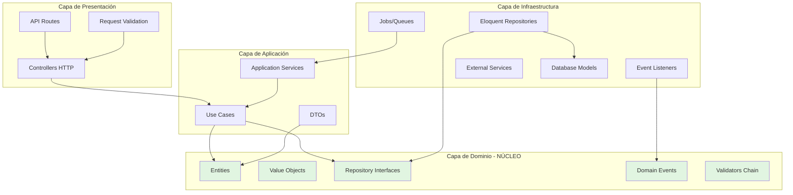
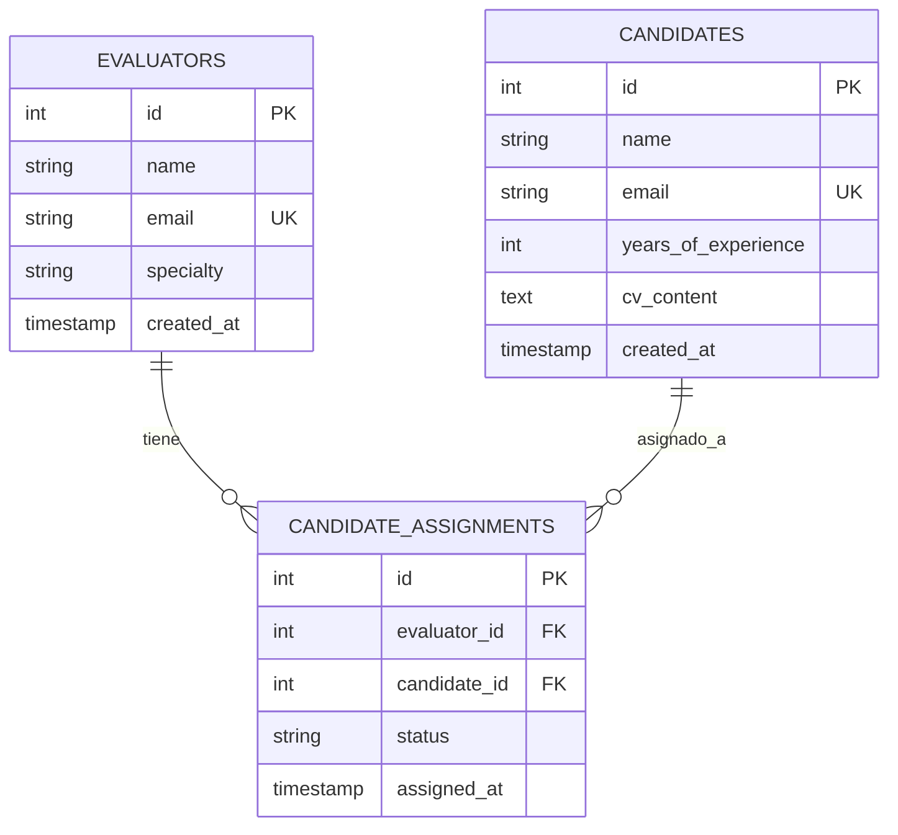

# API Gestión de Candidaturas - Desafío Backend Senior

[](https://laravel.com)
[](https://php.net)
[](#testing)
[](https://github.com/CristianLopez29/nalanda-backend-challenge)

> Sistema modular y escalable para gestionar candidaturas y evaluadores, implementado con **Arquitectura Hexagonal**, **patrones de diseño avanzados** y **mejores prácticas de software**.

---

## ⚡ Quick Start

```bash
# 1. Clone and install dependencies
git clone https://github.com/CristianLopez29/nalanda-backend-challenge.git
cd nalanda-backend-challenge

# 2. Install with Docker (first time)
docker run --rm \
    -u "$(id -u):$(id -g)" \
    -v "$(pwd):/var/www/html" \
    -w /var/www/html \
    laravelsail/php83-composer:latest \
    composer install --ignore-platform-reqs

# 3. Setup environment
cp .env.example .env

# 4. Start services (MySQL, Redis, Mailpit)
./vendor/bin/sail up -d

# 5. Initialize database and storage
./vendor/bin/sail artisan key:generate
./vendor/bin/sail artisan storage:link
./vendor/bin/sail artisan migrate:fresh --seed

# 6. Generate Swagger docs
./vendor/bin/sail artisan l5-swagger:generate

# 7. Run tests
./vendor/bin/sail artisan test
```

**🌐 Services Available:**
- **API**: http://localhost
- **Swagger**: http://localhost/api/documentation
- **Mailpit** (emails): http://localhost:8025

**🐳 Database Connections (from host machine):**
- **MySQL**: `127.0.0.1:3306` (solo si necesitas conectar con herramientas externas como TablePlus/DBeaver)
  - User: `sail`
  - Password: `password`
  - Database: `desafio_backend`
  - **Nota**: Desde la aplicación Laravel usa `DB_HOST=mysql` (dentro de Docker)
- **Redis**: `127.0.0.1:6379` (dentro de Docker usa `REDIS_HOST=redis`)

**⚡ Start Queue Worker** (for Excel reports):
```bash
# Required for processing background jobs (Excel generation)
# Ensure QUEUE_CONNECTION=redis in .env
./vendor/bin/sail artisan queue:work
```

---

## 📋 Tabla de Contenidos

- [🎯 Decisiones Arquitectónicas](#-decisiones-arquitectónicas)
- [📐 Diagrama de Capas](#-diagrama-de-capas)
- [📁 Estructura del Proyecto](#-estructura-del-proyecto)
- [🔧 Justificación Técnica](#-justificación-técnica)
- [🎨 Patrones Implementados](#-patrones-implementados)
- [🚀 Escalabilidad](#-escalabilidad)
- [💻 Cómo Ejecutar](#-cómo-ejecutar)
- [📡 Endpoints API](#-endpoints-api)
- [🧪 Testing](#-testing)
- [📦 Tecnologías](#-tecnologías)

---

## 🎯 Decisiones Arquitectónicas

### Arquitectura Hexagonal (Clean Architecture)

Se optó por **Arquitectura Hexagonal** (también conocida como Puertos y Adaptadores) por las siguientes razones:

#### ✅ **Desacoplamiento Total del Framework**
- La lógica de negocio (`Domain`) no tiene dependencias de Laravel
- Los casos de uso (`Application`) son framework-agnostic
- La infraestructura (`Infrastructure`) es completamente intercambiable
- **Beneficio:** Puedo reemplazar Laravel por Symfony sin tocar la lógica de negocio

#### ✅ **Testabilidad Superior**
- 91 tests passing with 353 assertions (comprehensive coverage)
- Los tests unitarios no requieren el framework
- Fakes y mocks son triviales de implementar
- **Beneficio:** Tests rápidos y confiables

#### ✅ **Mantenibilidad a Largo Plazo**
- Separación clara de responsabilidades
- Cada capa tiene un propósito específico
- Cambios en UI/DB no afectan la lógica de negocio
- **Beneficio:** Código que envejece bien

#### ✅ **Escalabilidad del Equipo**
- Equipos pueden trabajar en capas independientes
- Interfaces claras entre capas
- Onboarding más sencillo con estructura predecible
- **Beneficio:** Crecimiento del equipo sin fricción

### Decisión: Domain-Driven Design (DDD)

Se aplicaron principios de **DDD** para modelar el dominio:

- **Entidades:** `Candidate`, `Evaluator`, `CandidateAssignment`
- **Value Objects:** `Email`, `CV`, `YearsOfExperience`, `Specialty`, `AssignmentStatus`
- **Domain Events:** `CandidateRegistered` para audit logging
- **Repositories:** Interfaces en Domain, implementaciones en Infrastructure
- **DTOs:** Transferencia de datos entre capas sin exponer entidades

**¿Por qué?** El dominio de RRHH es complejo y las reglas de negocio cambian frecuentemente. DDD nos permite modelar el negocio de forma expresiva y mantenible.

---

## 📐 Diagrama de Capas



### Flujo de Datos

```
HTTP Request → Controller → Use Case → Domain Logic → Repository Interface
                                                              ↓
                                                    Repository Implementation → Database
```

**Regla de Oro:** Las dependencias siempre apuntan hacia adentro. El dominio nunca depende de infraestructura.

---

## 📁 Estructura del Proyecto

```
src/
├── Candidates/              # Módulo de Candidaturas
│   ├── Domain/              # Lógica de negocio pura (sin Laravel)
│   │   ├── Candidate.php    # Entidad del dominio
│   │   ├── ValueObjects/    # Email, CV, YearsOfExperience
│   │   ├── Validators/      # Chain of Responsibility
│   │   ├── Repositories/    # Interfaces (contratos)
│   │   ├── Events/          # Domain Events
│   │   └── Exceptions/      # Excepciones del dominio
│   ├── Application/         # Casos de uso
│   │   ├── RegisterCandidacyUseCase.php
│   │   ├── GetCandidateSummaryUseCase.php
│   │   └── DTO/             # Data Transfer Objects
│   └── Infrastructure/      # Implementaciones técnicas
│       ├── Persistence/     # Eloquent Models & Repositories
│       ├── Http/            # Controllers
│       ├── Listeners/       # Event Listeners
│       └── Providers/       # Service Providers
│
├── Evaluators/              # Módulo de Evaluadores
│   ├── Domain/              # Lógica de negocio pura
│   │   ├── Evaluator.php
│   │   ├── CandidateAssignment.php
│   │   ├── ValueObjects/    # Specialty, AssignmentStatus
│   │   ├── Repositories/    # Interfaces
│   │   └── Criteria/        # Query criteria objects
│   ├── Application/         # Casos de uso
│   │   ├── AssignCandidateUseCase.php
│   │   ├── GetConsolidatedEvaluatorsUseCase.php
│   │   └── DTO/
│   └── Infrastructure/
│       ├── Persistence/
│       ├── Http/
│       ├── Jobs/            # GenerateEvaluatorsReportJob
│       ├── Export/          # Excel exporters
│       └── Notifications/   # Email notifications
│
└── Shared/                  # Código compartido entre módulos
    ├── Domain/
    └── Infrastructure/
```

### Convenciones

- **Domain:** Sin dependencias externas. PHP puro.
- **Application:** Orquesta el dominio. No debe contener lógica de negocio.
- **Infrastructure:** Todo lo relacionado con Laravel, bases de datos, APIs externas.

---

## 🔧 Justificación Técnica

### ¿Por qué Chain of Responsibility para Validaciones?

```php
$validator = new RequiredCVValidator();
$validator
    ->setNext(new ValidEmailValidator())
    ->setNext(new MinimumExperienceValidator());

$validator->validate($candidate);
```

**Razones:**

1. **Extensibilidad:** Agregar nueva validación = crear nueva clase. No modificar código existente (Open/Closed Principle)
2. **Testabilidad:** Cada validador se prueba de forma aislada
3. **Reusabilidad:** Los validadores se pueden componer de diferentes formas
4. **Mantenibilidad:** Lógica de validación clara y localizada

### ¿Por qué Repository Pattern?

```php
// En Domain - interface
interface CandidateRepository {
    public function save(Candidate $candidate): void;
    public function findById(int $id): ?Candidate;
}

// En Infrastructure - implementación con Eloquent
class EloquentCandidateRepository implements CandidateRepository {
    // Implementación con Eloquent/MySQL
}
```

**Beneficios:**

- Puedo cambiar de Eloquent a Doctrine sin tocar casos de uso
- Fácil mockear en tests
- SQL complejo encapsulado en el repositorio

### ¿Por qué Value Objects?

```php
readonly class Email {
    public function __construct(private string $value) {
        if (!filter_var($value, FILTER_VALIDATE_EMAIL)) {
            throw new InvalidEmailException();
        }
    }
}
```

**Ventajas:**

- **Type Safety:** El compilador garantiza que siempre es un email válido
- **Inmutabilidad:** `readonly` previene mutaciones accidentales
- **Expresividad:** `$candidate->email()->value()` es más claro que `$candidate->email`
- **Validación centralizada:** La validación está en un solo lugar

---

## 🎨 Patrones Implementados

### 1. Chain of Responsibility
- **Ubicación:** `src/Candidates/Domain/Validators/`
- **Uso:** Validación extensible de candidaturas
- **Test:** `tests/Unit/Candidates/Domain/Validators/`

### 2. Repository Pattern
- **Ubicación:** Interfaces en `Domain/Repositories/`, implementaciones en `Infrastructure/Persistence/`
- **Uso:** Abstracción de persistencia
- **Test:** `tests/Feature/` con base de datos real

### 3. Data Transfer Object (DTO)
- **Ubicación:** `Application/DTO/`
- **Ejemplo:** `EvaluatorWithCandidatesDTO`, `CandidateSummaryDTO`
- **Uso:** Transferir datos entre capas sin exponer entidades

### 4. Value Object
- **Ubicación:** `Domain/ValueObjects/`
- **Ejemplos:** `Email`, `CV`, `YearsOfExperience`, `Specialty`, `AssignmentStatus`
- **Uso:** Encapsular validación y tipo safety

### 5. Domain Events
- **Ubicación:** `src/Candidates/Domain/Events/`
- **Evento:** `CandidateRegistered`
- **Listener:** `LogCandidateAction`
- **Uso:** Audit logging desacoplado

### 6. Strategy Pattern (implícito)
- En los validadores: cada validador es una estrategia de validación

---

## 🚀 Escalabilidad

### ✅ Implementado

#### 1. Colas (Queues)

**Estado:** ✅ **Implementado y funcionando**

```php
// src/Evaluators/Infrastructure/Jobs/GenerateEvaluatorsReportJob.php
class GenerateEvaluatorsReportJob implements ShouldQueue
{
    public function handle(GetConsolidatedEvaluatorsUseCase $useCase): void
    {
        // Genera Excel y notifica por email cuando termina
    }
}
```

**Beneficios:**
- ✅ API responde inmediatamente (202 Accepted)
- ✅ Reporte generado en background
- ✅ Notificación por email cuando finaliza
- ✅ Configurado con Redis y Laravel Horizon ready

**Cómo ejecutar:**
```bash
./vendor/bin/sail artisan queue:work
```

#### 2. Idempotencia

**Estado:** ✅ **Implementado con `ShouldBeUnique`**

```php
class GenerateEvaluatorsReportJob implements ShouldQueue, ShouldBeUnique
{
    public int $uniqueFor = 3600; // 1 hour
    
    public function uniqueId(): string
    {
        return "generate-evaluators-report:{$this->userEmail}";
    }
}
```

**Beneficios:**
- ✅ Previene duplicación de reportes
- ✅ Solo un job por email en cola/procesando
- ✅ TTL de 1 hora configurable

### 📦 Infraestructura Preparada

#### 3. Cache

**Estado:** 📦 Redis configurado, implementación lista para activar

```php
// Ejemplo de implementación (comentado en código)
Cache::remember("evaluators.consolidated.{$criteria->cacheKey()}", 300, function() {
    return $this->repository->findAllWithCandidates($criteria);
});

// Invalidación automática
Cache::tags(['evaluators'])->flush();
```

**Beneficios esperados:** Reducción de ~80% en queries para listados repetidos.

#### 4. Concurrencia (Pessimistic Locking)

**Estado:** 📦 Preparado para alta concurrencia

```php
// Implementación sugerida para assignments masivos
DB::transaction(function() use ($evaluatorId, $candidateId) {
    $assignment = CandidateAssignmentModel::lockForUpdate()
        ->where('candidate_id', $candidateId)
        ->first();
    
    if ($assignment) {
        throw new CandidateAlreadyAssignedException();
    }
});
```

### SQL Optimizado para Alto Rendimiento

**Diagrama de Relaciones:**



**Query Consolidado con GROUP_CONCAT:**

```sql
SELECT 
    evaluators.*,
    COUNT(DISTINCT candidate_assignments.id) as total_candidates,
    AVG(candidates.years_of_experience) as avg_experience,
    GROUP_CONCAT(DISTINCT candidates.email ORDER BY candidates.email SEPARATOR ", ") as candidate_emails
FROM evaluators
LEFT JOIN candidate_assignments ON evaluators.id = candidate_assignments.evaluator_id
LEFT JOIN candidates ON candidate_assignments.candidate_id = candidates.id
GROUP BY evaluators.id
ORDER BY avg_experience DESC
```

**Beneficios:**
- ✅ Una sola query (evita N+1)
- ✅ Agregaciones en SQL (no en PHP)
- ✅ Escalable a millones de registros con índices
- ✅ Paginación eficiente

---

## 💻 Cómo Ejecutar

### Requisitos Previos

- Docker Desktop instalado
- Git

### Instalación con Docker (Laravel Sail)

```bash
# 1. Clonar repositorio
git clone https://github.com/CristianLopez29/nalanda-backend-challenge.git
cd nalanda-backend-challenge

# 2. Instalar dependencias (primera vez)
docker run --rm \
    -u "$(id -u):$(id -g)" \
    -v "$(pwd):/var/www/html" \
    -w /var/www/html \
    laravelsail/php83-composer:latest \
    composer install --ignore-platform-reqs

# 3. Copiar archivo de entorno
cp .env.example .env

# 4. Levantar servicios (MySQL, Redis, Mailpit)
./vendor/bin/sail up -d

# 5. Generar key de aplicación
./vendor/bin/sail artisan key:generate

# 6. Ejecutar migraciones y seeders
./vendor/bin/sail artisan migrate:fresh --seed

# 7. Generar documentación Swagger
./vendor/bin/sail artisan l5-swagger:generate
```

### Servicios Disponibles

| Servicio | URL | Descripción |
|----------|-----|-------------|
| **API** | http://localhost | API REST principal |
| **Swagger** | http://localhost/api/documentation | Documentación interactiva |
| **Mailpit** | http://localhost:8025 | Visor de emails (para notificaciones) |
| **MySQL** | localhost:3306 | Base de datos (user: `sail`, pass: `password`) |
| **Redis** | localhost:6379 | Cache y colas |

### Ejecutar Queue Worker (Importante)

Para procesar los jobs de generación de reportes:

```bash
./vendor/bin/sail artisan queue:work
```

> **Nota:** En producción usar Supervisor para mantener el worker ejecutándose.

### Ejecutar Tests

```bash
# Todos los tests
./vendor/bin/sail artisan test

# Con coverage
./vendor/bin/sail artisan test --coverage

# Solo unitarios
./vendor/bin/sail artisan test --testsuite Unit

# Solo feature
./vendor/bin/sail artisan test --testsuite Feature

# Test específico
./vendor/bin/sail artisan test --filter GetConsolidatedEvaluatorsTest
```

### Datos de Prueba (Seeders)

El comando `migrate:fresh --seed` crea:

- 20 candidatos con diferentes niveles de experiencia
- 5 evaluadores (backend, frontend, fullstack, devops, mobile)
- ~15-20 asignaciones con estados variados

---

## 📡 Endpoints API

### Candidatos

#### `POST /api/candidates`
Registrar nueva candidatura.

**Body:**
```json
{
  "name": "Juan Pérez",
  "email": "juan@example.com",
  "years_of_experience": 5,
  "cv_content": "Desarrollador Full Stack con 5 años..."
}
```

**Response:** `201 Created`

---

#### `GET /api/candidates/{id}/summary`
Obtener resumen completo de candidatura con validaciones.

**Response:**
```json
{
  "id": 1,
  "name": "Juan Pérez",
  "email": "juan@example.com",
  "years_of_experience": 5,
  "cv_content": "...",
  "assignment": {
    "evaluator_name": "Dr. Alberto Martínez",
    "evaluator_email": "alberto@nalanda.com",
    "assigned_at": "2024-11-20 10:30:00",
    "status": "in_progress"
  },
  "validation_results": {
    "CV Requerido": "Passed",
    "Email Válido": "Passed",
    "Experiencia Mínima": "Passed"
  }
}
```

---

### Evaluadores

#### `POST /api/evaluators`
Registrar nuevo evaluador.

**Body:**
```json
{
  "name": "María González",
  "email": "maria@example.com",
  "specialty": "backend"
}
```

**Specialties válidos:** `backend`, `frontend`, `fullstack`, `devops`, `mobile`

---

#### `GET /api/evaluators/consolidated`
Listado consolidado con SQL complejo (GROUP_CONCAT, JOIN, AVG, COUNT).

**Query Parameters:**
- `page`: Número de página (default: 1)
- `per_page`: Items por página (default: 15)
- `search`: Filtrar por nombre o email
- `sort_by`: Ordenar por (`name`, `email`, `created_at`, `average_experience`, `specialty`, `total_assigned_candidates`, `concatenated_candidate_emails`)
- `sort_direction`: `asc` o `desc` (default: `desc`)

**Orden por defecto:** El listado se ordena por `average_experience` (promedio de años de experiencia de candidatos por evaluador) en orden descendente. Esto satisface el requisito de "orden por años de experiencia" de forma agregada y optimizada a nivel SQL. Si necesitas otro criterio de orden, puedes especificarlo vía `sort_by`.

**Filtros opcionales (cualquier columna del listado):**
- `specialty`: Filtra por especialidad del evaluador (like).
- `min_average_experience` / `max_average_experience`: Rango de promedio de experiencia.
- `min_total_assigned` / `max_total_assigned`: Rango de candidatos asignados (COUNT en SQL).
- `candidate_email_contains`: Filtra por emails concatenados de candidatos (GROUP_CONCAT en SQL).

**Response:**
```json
{
  "data": [
    {
      "id": 1,
      "name": "Dr. Alberto Martínez",
      "email": "alberto@nalanda.com",
      "specialty": "backend",
      "average_candidate_experience": 5.3,
      "total_assigned_candidates": 4,
      "concatenated_candidate_emails": "ana@example.com, carlos@example.com, juan@example.com, maria@example.com",
      "candidates": [
        {
          "id": 1,
          "name": "Juan Pérez",
          "email": "juan@example.com",
          "years_of_experience": 5
        }
      ]
    }
  ],
  "meta": {
    "current_page": 1,
    "last_page": 1,
    "per_page": 15,
    "total": 5
  }
}
```

---

#### `POST /api/evaluators/{evaluatorId}/assign-candidate`
Asignar candidato a evaluador.

**Body:**
```json
{
  "candidate_id": 1
}
```

**Response:** `201 Created`

---

#### `GET /api/evaluators/{evaluatorId}/candidates`
Obtener candidatos asignados a un evaluador.

**Response:**
```json
{
  "evaluator": {
    "id": 1,
    "name": "Dr. Alberto Martínez",
    "email": "alberto@nalanda.com",
    "specialty": "backend"
  },
  "candidates": [
    {
      "id": 1,
      "name": "Juan Pérez",
      "email": "juan@example.com",
      "years_of_experience": 5,
      "assignment_status": "in_progress",
      "assigned_at": "2024-11-20 10:30:00"
    }
  ]
}
```

---

#### `POST /api/evaluators/report`
Generar reporte Excel (asíncrono con cola).

**Body:**
```json
{
  "email": "recipient@example.com"
}
```

**Response:** `202 Accepted`

El reporte se genera en background y se envía por email cuando está listo.

---

## 🧪 Testing

### Cobertura

- **Total:** 91 tests passing (353 assertions)
- **Unitarios:** 29 tests
  - Validators (Chain of Responsibility): 8 tests
  - Domain Entities: 8 tests
  - Value Objects: 13 tests
- **Feature:** 62 tests de integración
  - Candidates endpoints: 11 tests
  - Evaluators endpoints: 50 tests
  - Audit logging: 1 test
  - Cobertura completa de casos de borde y validaciones

### Tests Destacados

**Chain of Responsibility:**
```php
tests/Unit/Candidates/Domain/Validators/
├── MinimumExperienceValidatorTest.php (4 tests)
├── RequiredCVValidatorTest.php (2 tests)
└── ValidEmailValidatorTest.php (2 tests)
```

**Endpoints Complejos:**
```php
tests/Feature/Evaluators/GetConsolidatedEvaluatorsTest.php
└── should_return_consolidated_list_of_evaluators_and_candidates
    // Verifica SQL con GROUP_CONCAT, filtros, paginación
```

**Integración Real:**
```php
tests/Feature/Candidates/RegisterCandidacyTest.php
└── should_register_a_valid_candidacy
    // Inserta en DB, verifica domain events, audit log
```

### Ejecutar Tests

```bash
# Todos
sail artisan test

# Específicos
sail artisan test --filter=Validator
sail artisan test --testsuite=Unit
```

---

## 📦 Tecnologías

### Core
- **Laravel 12** - Framework base
- **PHP 8.2** - Lenguaje (typed properties, readonly, enums)
- **MySQL 8.0** - Base de datos relacional

### Arquitectura
- **Hexagonal Architecture** - Desacoplamiento de capas
- **Domain-Driven Design** - Modelado del dominio
- **SOLID Principles** - Código mantenible

### Librerías
- `maatwebsite/excel` - Exportación de reportes Excel
- `darkaonline/l5-swagger` - Documentación OpenAPI
- `phpunit/phpunit` - Testing framework

### DevOps
- **Docker** (Laravel Sail) - Desarrollo local
- **Redis** - Cache y colas
- **Mailpit** - Testing de emails

---

## � Troubleshooting

### Los tests fallan con error de conexión a la base de datos

```bash
# Limpiar configuración y reiniciar
./vendor/bin/sail artisan config:clear
./vendor/bin/sail artisan migrate:fresh --seed
./vendor/bin/sail artisan test
```

### El queue worker no procesa jobs

```bash
# Reiniciar el worker
./vendor/bin/sail artisan queue:restart

# En otra terminal, iniciar el worker
./vendor/bin/sail artisan queue:work

# Verificar que el job fue despachado
./vendor/bin/sail artisan queue:failed
```

### Error "Class not found" después de crear nuevas clases

```bash
# Regenerar autoload
./vendor/bin/sail composer dump-autoload
```

### Los emails no se envían (reportes)

```bash
# Verificar que Mailpit está corriendo
docker compose ps

# Acceder a Mailpit UI
open http://localhost:8025

# Verificar logs del job
./vendor/bin/sail artisan queue:work --verbose
```

### Swagger no se genera correctamente

```bash
# Limpiar cache y regenerar
./vendor/bin/sail artisan config:clear
./vendor/bin/sail artisan route:clear
./vendor/bin/sail artisan l5-swagger:generate
```

### Error de permisos en storage/

```bash
# Dar permisos (Linux/Mac)
./vendor/bin/sail artisan storage:link
sudo chmod -R 777 storage bootstrap/cache

# Windows: Ejecutar como Administrador o ajustar permisos en propiedades
```

---

## �📝 Notas Finales

### 🌟 Puntos Fuertes

✅ **Arquitectura Senior:** Hexagonal + DDD correctamente implementados  
✅ **SQL Complejo:** GROUP_CONCAT, JOINs, agregaciones múltiples  
✅ **Patrones:** Chain of Responsibility extensible  
✅ **Testing:** 65 tests (29 unit + 36 feature) que cubren casos críticos  
✅ **Escalabilidad Implementada:** Queues + Idempotencia con `ShouldBeUnique`  
✅ **Documentación:** Swagger + README completo con diagramas  

---

## 🗺️ Roadmap (Mejoras Opcionales)

> ⚠️ **IMPORTANTE**: Las siguientes mejoras **NO están implementadas**. Esta es una lista de posibles mejoras futuras que están **fuera del scope** de la prueba técnica, pero que podrían agregarse en un entorno de producción real.

### Performance
- [ ] **Cache Layer**: Implementar caching activo con invalidación inteligente (Redis ya configurado pero cache no activo)
- [ ] **Database Indexing**: Añadir índices compuestos para queries complejas
- [ ] **Query Optimization**: Lazy loading selectivo para reducir memoria

### Concurrencia
- [ ] **Pessimistic Locking**: Para asignaciones masivas simultáneas
- [ ] **Optimistic Locking**: Version control en entidades críticas
- [ ] **Rate Limiting**: Throttling por IP/usuario en endpoints públicos

### Features
- [ ] **Excel Multi-Sheet Pagination**: Paginación automática (50 evaluadores/hoja) - *Actualmente genera una sola hoja con todos los registros*
- [ ] **Event Sourcing**: Historial completo de cambios en assignments
- [ ] **Webhooks**: Notificaciones en tiempo real de cambios
- [ ] **API Versioning**: v1, v2 con deprecation strategy

### DevOps
- [ ] **CI/CD Pipeline**: GitHub Actions para tests + deploy automático
- [ ] **Monitoring**: Laravel Telescope + Sentry para errores
- [ ] **Logs Estructurados**: JSON logging para Elasticsearch/Datadog
- [ ] **Health Checks**: Endpoints `/health` y `/readiness`

---

## � Preguntas y Soporte

Para preguntas sobre implementación, decisiones arquitectónicas o detalles técnicos:

1. **Revisar el código fuente**: La estructura está auto-documentada
2. **Consultar los tests**: 65 tests documentan el comportamiento esperado
3. **Swagger**: Documentación interactiva de la API

> La arquitectura del proyecto está diseñada para ser **auto-explicativa** mediante código limpio, tests comprensivos y documentación integrada.

---

<p align="center">
  <strong>Desarrollado con Arquitectura Hexagonal y Patrones de Diseño</strong><br>
  Laravel 12 | PHP 8.2 | MySQL | Redis | Docker
</p>
