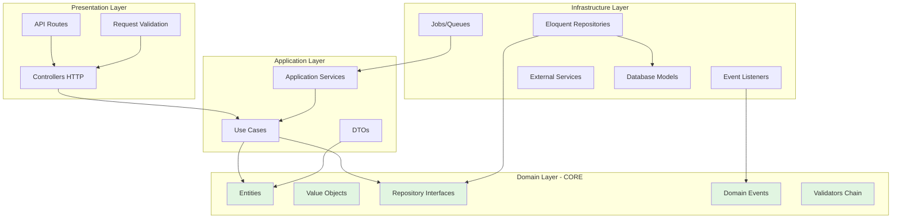
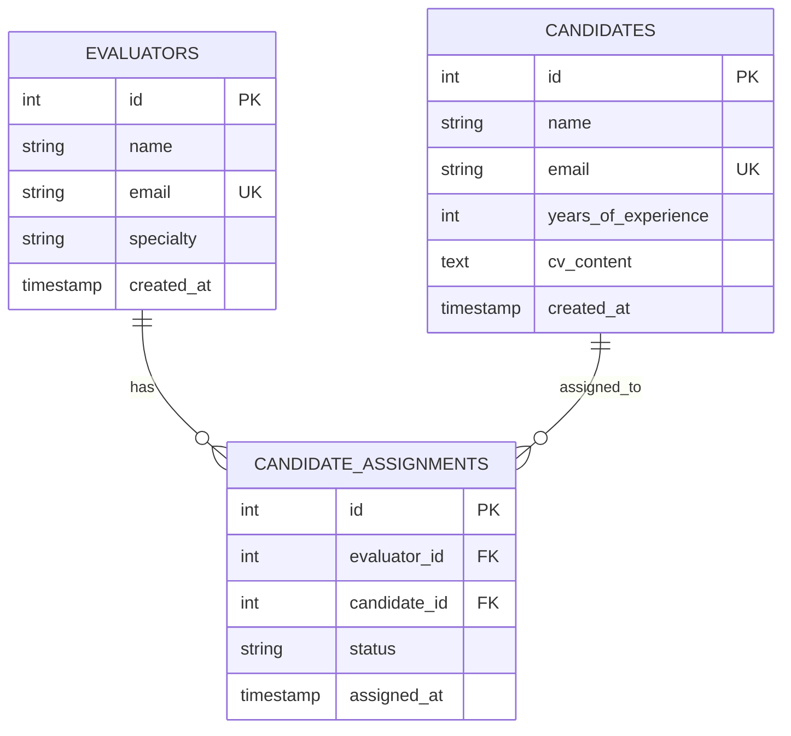

# Candidacy Management API

[](https://laravel.com)
[](https://php.net)
[](#-testing)
[](#code-quality--static-analysis)
[](#-license)
[](https://github.com/CristianLopez29/manage-applications-and-evaluators)

> Modular and scalable system for managing candidacies and evaluators, implemented with **Hexagonal Architecture**, **advanced design patterns**, and **software best practices**.

---

## 🎯 Architectural Decisions

### Hexagonal Architecture (Clean Architecture)

**Hexagonal Architecture** (also known as Ports and Adapters) was chosen for the following reasons:

#### ✅ **Total Framework Decoupling**
- Business logic (`Domain`) has no Laravel dependencies
- Use cases (`Application`) are framework-agnostic
- Infrastructure (`Infrastructure`) is completely interchangeable
- **Benefit:** I can replace Laravel with Symfony without touching business logic

#### ✅ **Superior Testability**
- 136 tests passing across unit, integration and acceptance layers
- Unit tests do not require the framework
- Fakes and mocks are trivial to implement
- **Benefit:** Fast and reliable tests

#### ✅ **Long-Term Maintainability**
- Clear separation of responsibilities
- Each layer has a specific purpose
- Changes in UI/DB do not affect business logic
- **Benefit:** Code that ages well

#### ✅ **Team Scalability**
- Teams can work on independent layers
- Clear interfaces between layers
- Easier onboarding with predictable structure
- **Benefit:** Frictionless team growth

### Decision: Domain-Driven Design (DDD)

**DDD** principles were applied to model the domain:

- **Entities:** `Candidate`, `Evaluator`, `CandidateAssignment`
- **Value Objects:** `Email`, `CV`, `YearsOfExperience`, `EvaluatorName`
- **Enums:** `Specialty`, `AssignmentStatus`
- **Domain Events:** `CandidateRegistered`, `CandidateAnalysisCompleted`, `CandidateAssigned`,
  `AssignmentStatusChanged` — consumed by listeners for audit, notifications, history and cache invalidation
- **Repositories:** Interfaces in Domain, implementations in Infrastructure
- **DTOs:** Data transfer between layers without exposing entities

**Why?** The HR domain is complex and business rules change frequently. DDD allows us to model the business expressively and maintainably.

---

## 📁 Project Structure

```
src/
├── Candidates/              # Candidacy Module
│   ├── Bindings.php         # DI bindings + module routes (ServiceProvider)
│   ├── Domain/              # Pure business logic (no Laravel)
│   │   ├── Candidate.php    # Domain Entity
│   │   ├── ValueObjects/    # Email, CV, YearsOfExperience
│   │   ├── Validators/      # Chain of Responsibility
│   │   ├── Repositories/    # Interfaces (contracts)
│   │   ├── Services/        # AiScreeningService port
│   │   ├── Events/          # CandidateRegistered, CandidateAnalysisCompleted
│   │   └── Exceptions/      # Domain Exceptions
│   ├── Application/
│   │   ├── UseCases/        # RegisterCandidacy, GetCandidateSummary, ListCandidates…
│   │   ├── DTOs/            # Request/Response objects
│   │   └── Transformers/    # Domain → DTO mapping
│   └── Infrastructure/      # Technical implementations
│       ├── Persistence/     # Eloquent Models & Repositories
│       ├── Controllers/     # Single-action HTTP controllers
│       ├── Ai/              # OpenAI / Gemini screening adapters
│       ├── Jobs/            # AnalyzeCandidateCvJob
│       └── Listeners/       # Event Listeners
│
├── Evaluators/              # Evaluators Module
│   ├── Bindings.php
│   ├── Domain/              # Pure business logic
│   │   ├── Evaluator.php
│   │   ├── CandidateAssignment.php
│   │   ├── ValueObjects/    # EvaluatorName
│   │   ├── Enums/           # Specialty, AssignmentStatus
│   │   ├── Repositories/    # Interfaces
│   │   ├── Events/          # CandidateAssigned, AssignmentStatusChanged
│   │   └── Criteria/        # Query criteria objects
│   ├── Application/
│   │   ├── UseCases/        # AssignCandidateToEvaluator, GetConsolidatedEvaluators…
│   │   ├── DTOs/
│   │   ├── Ports/           # EvaluatorCachePort
│   │   └── Transformers/
│   └── Infrastructure/
│       ├── Persistence/
│       ├── Controllers/
│       ├── Cache/           # LaravelEvaluatorCache (tag-based)
│       ├── Jobs/            # GenerateEvaluatorsReportJob, ProcessOverdueAssignmentsJob
│       ├── Export/          # Excel exporters
│       ├── Listeners/       # Audit, notifications, history, cache invalidation
│       └── Notifications/   # Email notifications
│
└── Shared/                  # Shared kernel
    ├── Domain/              # AggregateRoot, DomainEvent, DomainEventPublisher, AuditLogger
    ├── Application/Ports/   # TransactionManager
    └── Infrastructure/      # Laravel adapters for the ports above
```

### Conventions

- **Domain:** No external dependencies. Pure PHP.
- **Application:** Orchestrates the domain. Must not contain business logic.
- **Infrastructure:** Everything related to Laravel, databases, external APIs.
- **Use Cases** expose a single `execute()`; **controllers** are single-action `__invoke`.
- Each module's `Bindings.php` registers its ports → adapters *and* its routes, so a module is
  self-contained: `routes/api.php` only holds cross-cutting endpoints (auth, health, reports).

---

## ⚡ Quick Start

Everything runs through `make`, which wraps `docker compose`. Laravel Sail's `vendor/bin/sail` script is
intentionally not used: it needs a POSIX shell and misbehaves on Windows.

```bash
# 1. Clone and install dependencies
git clone https://github.com/CristianLopez29/manage-applications-and-evaluators.git
cd manage-applications-and-evaluators

# 2. Install with Docker (first time)
docker run --rm \
    -u "$(id -u):$(id -g)" \
    -v "$(pwd):/var/www/html" \
    -w /var/www/html \
    laravelsail/php84-composer:latest \
    composer install --ignore-platform-reqs

# 3. Setup environment
cp .env.example .env

# 4. Start services (MySQL, Redis, Mailpit)
make up

# 5. Initialize database and storage
docker compose exec -T laravel php artisan key:generate
make storage-link
make fresh

# 6. Generate Swagger docs
make swagger

# 7. Run tests
make test
```

`make help` lists every target; `make urls` prints the URLs below.

**🌐 Services Available:**
- **API**: http://localhost:8080
- **Swagger**: http://localhost:8080/api/documentation
- **Mailpit** (emails): http://localhost:8025

> **Ports.** `APP_PORT` defaults to `8080` and `VITE_PORT` to `5174` so the stack coexists with other
> local Docker projects on ports 80/5173. Override per call: `make up APP_PORT=80`.

**🐳 Database Connections (from host machine):**
- **MySQL**: `127.0.0.1:3306` (only if you need to connect with external tools like TablePlus/DBeaver)
  - User: `sail`
  - Password: `password`
  - Database: `laravel`
  - **Note**: From the Laravel application use `DB_HOST=mysql` (inside Docker)
- **Redis**: `127.0.0.1:6379` (inside Docker use `REDIS_HOST=redis`)

**⚡ Start Queue Worker** (for Excel reports and AI screening):
```bash
# Required for processing background jobs; without it those endpoints
# answer 202 and nothing ever completes. Ensure QUEUE_CONNECTION=redis in .env
make queue
```

---

## 📋 Table of Contents

- [🎯 Architectural Decisions](#-architectural-decisions)
- [📁 Project Structure](#-project-structure)
- [⚡ Quick Start](#-quick-start)
- [📐 Layer Diagram](#-layer-diagram)
- [🔧 Technical Justification](#-technical-justification)
- [🎨 Implemented Patterns](#-implemented-patterns)
- [🚀 Scalability](#-scalability)
- [💻 How to Run](#-how-to-run)
- [📡 API Endpoints](#-api-endpoints)
- [🧪 Testing](#-testing)
- [📦 Technologies](#-technologies)
- [🛠️ Troubleshooting](#️-troubleshooting)
- [🗺️ Roadmap](#️-roadmap-optional-improvements)
- [📄 License](#-license)

---

## 📐 Layer Diagram


```mermaid
graph TD
    subgraph "Presentation Layer"
        A[Controllers HTTP]
        B[API Routes]
        C[Request Validation]
    end
    
    subgraph "Application Layer"
        D[Use Cases]
        E[DTOs]
        F[Application Services]
    end
    
    subgraph "Domain Layer - CORE"
        G[Entities]
        H[Value Objects]
        I[Repository Interfaces]
        J[Domain Events]
        K[Validators Chain]
    end
    
    subgraph "Infrastructure Layer"
        L[Eloquent Repositories]
        M[Event Listeners]
        N[Jobs/Queues]
        O[External Services]
        P[Database Models]
    end
    
    A --> D
    B --> A
    C --> A
    D --> I
    D --> G
    E --> G
    F --> D
    L --> I
    L --> P
    M --> J
    N --> F
    
    style G fill:#e1f5e1
    style H fill:#e1f5e1
    style I fill:#e1f5e1
    style J fill:#e1f5e1
    style K fill:#e1f5e1
```

### Data Flow

```
HTTP Request → Controller → Use Case → Domain Logic → Repository Interface
                                                              ↓
                                                    Repository Implementation → Database
```

**Golden Rule:** Dependencies always point inwards. The domain never depends on infrastructure.

---

## 🔧 Technical Justification

### Why Chain of Responsibility for Validations?

```php
$validator = new RequiredCVValidator();
$validator
    ->setNext(new ValidEmailValidator())
    ->setNext(new MinimumExperienceValidator());

$validator->validate($candidate);
```

**Reasons:**

1. **Extensibility:** Add new validation = create new class. Do not modify existing code (Open/Closed Principle)
2. **Testability:** Each validator is tested in isolation
3. **Reusability:** Validators can be composed in different ways
4. **Maintainability:** Clear and localized validation logic

### Why Repository Pattern?

```php
// In Domain - interface
interface CandidateRepository {
    public function save(Candidate $candidate): void;
    public function findById(int $id): ?Candidate;
}

// In Infrastructure - implementation with Eloquent
class EloquentCandidateRepository implements CandidateRepository {
    // Implementation with Eloquent/MySQL
}
```

**Benefits:**

- I can switch from Eloquent to Doctrine without touching use cases
- Easy to mock in tests
- Complex SQL encapsulated in the repository

### Why Value Objects?

```php
readonly class Email {
    public function __construct(private string $value) {
        if (!filter_var($value, FILTER_VALIDATE_EMAIL)) {
            throw new InvalidEmailException();
        }
    }
}
```

**Advantages:**

- **Type Safety:** The compiler guarantees it is always a valid email
- **Immutability:** `readonly` prevents accidental mutations
- **Expressiveness:** `$candidate->email()->value()` is clearer than `$candidate->email`
- **Centralized Validation:** Validation is in one place

---

## 🎨 Implemented Patterns

### 1. Chain of Responsibility
- **Location:** `src/Candidates/Domain/Validators/`
- **Usage:** Extensible candidacy validation
- **Test:** `tests/Candidates/Unit/`

### 2. Repository Pattern
- **Location:** Interfaces in `Domain/Repositories/`, implementations in `Infrastructure/Persistence/`
- **Usage:** Persistence abstraction
- **Test:** `tests/{Module}/Integration/` against the real database

### 3. Data Transfer Object (DTO)
- **Location:** `Application/DTOs/`
- **Example:** `EvaluatorWithCandidatesDTO`, `CandidateSummaryDTO`
- **Usage:** Transfer data between layers without exposing entities

### 4. Value Object
- **Location:** `Domain/ValueObjects/`
- **Examples:** `Email`, `CV`, `YearsOfExperience`, `EvaluatorName`
- **Usage:** Encapsulate validation and type safety

### 5. Domain Events
- **Location:** `src/{Module}/Domain/Events/`
- **Events:** `CandidateRegistered`, `CandidateAssigned`, `AssignmentStatusChanged`
- **Listeners:** `LogCandidateAction`, `SendAssignmentNotifications`, `RecordAssignmentHistory`,
  `InvalidateEvaluatorCache` — all registered in the owning module's `Bindings::boot()`
- **Usage:** Decoupled audit logging, notifications, history and cache invalidation

### 6. Ports & Adapters beyond persistence
- **`AiScreeningService`** (Domain) → `OpenAiScreeningAdapter` / `GeminiScreeningAdapter`, selected at
  runtime by `AI_PROVIDER` — the Strategy pattern applied to an external service
- **`EvaluatorCachePort`** (Application) → `LaravelEvaluatorCache`, so the use case never sees `Cache::`
- **`TransactionManager`** / **`DomainEventPublisher`** (Shared) → keep `DB::` and the `Event` facade
  out of the Application layer

---

## 🚀 Scalability

### ✅ Implemented

#### 1. Queues

**Status:** ✅ **Implemented and working**

```php
// src/Evaluators/Infrastructure/Jobs/GenerateEvaluatorsReportJob.php
class GenerateEvaluatorsReportJob implements ShouldQueue
{
    public function handle(GetConsolidatedEvaluatorsUseCase $useCase): void
    {
        // Generates Excel and notifies by email when finished
    }
}
```

**Benefits:**
- ✅ API responds immediately (202 Accepted)
- ✅ Report generated in background
- ✅ Email notification when finished
- ✅ Configured with Redis and Laravel Horizon ready

**How to run:**
```bash
make queue
```

#### 2. Idempotency

**Status:** ✅ **Implemented with `ShouldBeUnique`**

```php
class GenerateEvaluatorsReportJob implements ShouldQueue, ShouldBeUnique
{
    public int $uniqueFor = 3600; // 1 hour
    
    public function uniqueId(): string
    {
        return "generate-evaluators-report:{$this->userEmail}";
    }
}
```

**Benefits:**
- ✅ Prevents report duplication
- ✅ Only one job per email in queue/processing
- ✅ Configurable 1 hour TTL

#### 3. Overdue Reminders & Escalation

**Status:** ✅ Implemented

- Automatic reminders sent when an assignment passes its deadline
- Escalation to admins when overdue exceeds a threshold (configurable via `OVERDUE_ESCALATION_DAYS`, default: 3)
- Separate email notifications for evaluator and candidate

```php
// Job
// src/Evaluators/Infrastructure/Jobs/ProcessOverdueAssignmentsJob.php
// Notifications
// - Src\Evaluators\Infrastructure\Notifications\OverdueAssignmentNotification
// - Src\Evaluators\Infrastructure\Notifications\OverdueAssignmentEscalationNotification
```

#### 4. Rate Limiting

**Status:** ✅ Implemented

- Login (`POST /api/login`): `throttle:login`
  - 5 requests per minute per (email+IP)
  - 30 requests per minute per IP
  - Defined in AppServiceProvider → `RateLimiter::for('login', ...)`
- Authenticated group: `throttle:60,1`
  - 60 requests per minute per IP for protected routes
  - Configured in API routes
- When limits are exceeded:
  - HTTP 429 (Too Many Requests) with `Retry-After` header
  - Enforced by Laravel's throttle middleware

#### 5. Health Checks

**Status:** ✅ Implemented

- Liveness: `/up` provided by the framework health route
  - Defined during bootstrap
- Readiness: `/api/readiness`
  - In production, requires `X-Health-Check-Token` header matching `HEALTHCHECK_TOKEN`
  - Performs database and cache checks and returns a JSON with `status`, `checks`, and `time`

### ✅ Additional Implemented Infrastructure

#### 6. Monitoring (Sentry)

**Status:** ✅ Implemented

- Package: `sentry/sentry-laravel`
- Configuration: set `SENTRY_LARAVEL_DSN` in environment to enable error reporting
- Behavior: unhandled exceptions are captured and sent to Sentry via the stack channel
- Optional: performance monitoring can be enabled via Sentry environment variables if needed

#### 7. Structured Logging (correlation id)

**Status:** ✅ **Implemented**

- An `AddRequestContext` middleware binds a `request_id` (correlation id) and the authenticated `user_id` to the logging context of every authenticated API request.
- The id is returned in the `X-Request-Id` response header — and honoured if the caller already sent one — enabling end-to-end tracing across clients, proxies and logs.
- A ready-to-use `json` log channel (`LOG_CHANNEL=json`) emits one structured JSON line per record for ingestion into ELK / Datadog / Loki.

#### 8. API Versioning

**Status:** ✅ **Implemented**

- Business resources are served under the `/api/v1` prefix (`/api/v1/candidates`, `/api/v1/evaluators`, …).
- Cross-cutting infrastructure endpoints (`/api/login`, `/api/health`, `/api/readiness`) are intentionally kept unversioned, so the versioned contract covers only the business API and can evolve to `/api/v2` without disrupting auth or health probes.

#### 9. Cache

**Status:** ✅ **Implemented** (active, event-driven invalidation)

The consolidated listing is cached behind an Application port (`EvaluatorCachePort`)
so the use case stays framework-free. The adapter (`LaravelEvaluatorCache`) uses
tag-based caching for Redis and falls back to a tagless flush for other drivers.

```php
// src/Evaluators/Application/UseCases/GetConsolidatedEvaluators.php
$paginator = $this->cache->remember($key, $ttl, fn () => $this->repository->findAllWithCandidates($criteria));

// src/Evaluators/Infrastructure/Cache/LaravelEvaluatorCache.php
Cache::tags(['evaluators'])->remember($key, $ttl, $closure);
Cache::tags(['evaluators'])->flush(); // on CandidateAssigned / AssignmentStatusChanged
```

Invalidation is event-driven via the `InvalidateEvaluatorCache` listener — no
coupling in the use cases.

#### 10. Concurrency (Pessimistic Locking)

**Status:** ✅ **Implemented**

Assignment and reassignment lock the candidate's current assignment row
(`SELECT ... FOR UPDATE`) inside a transaction to prevent race conditions.

```php
// src/Evaluators/Infrastructure/Persistence/EloquentAssignmentRepository.php
public function findByCandidateIdForUpdate(int $candidateId): ?CandidateAssignment
{
    // ...->lockForUpdate()->first();
}

// Used by AssignCandidateToEvaluator and ReassignCandidate use cases
```

### SQL Optimized for High Performance

**Relationship Diagram:**


```mermaid
erDiagram
    EVALUATORS ||--o{ CANDIDATE_ASSIGNMENTS : "has"
    CANDIDATES ||--o{ CANDIDATE_ASSIGNMENTS : "assigned_to"
    
    EVALUATORS {
        int id PK
        string name
        string email UK
        string specialty
        timestamp created_at
    }
    
    CANDIDATES {
        int id PK
        string name
        string email UK
        int years_of_experience
        text cv_content
        timestamp created_at
    }
    
    CANDIDATE_ASSIGNMENTS {
        int id PK
        int evaluator_id FK
        int candidate_id FK
        string status
        timestamp assigned_at
    }
```

**Consolidated Query with GROUP_CONCAT:**

```sql
SELECT 
    evaluators.*,
    COUNT(DISTINCT candidate_assignments.id) as total_candidates,
    AVG(candidates.years_of_experience) as avg_experience,
    GROUP_CONCAT(DISTINCT candidates.email ORDER BY candidates.email SEPARATOR ", ") as candidate_emails
FROM evaluators
LEFT JOIN candidate_assignments ON evaluators.id = candidate_assignments.evaluator_id
LEFT JOIN candidates ON candidate_assignments.candidate_id = candidates.id
GROUP BY evaluators.id
ORDER BY avg_experience DESC
```

**Benefits:**
- ✅ Single query (avoids N+1)
- ✅ Aggregations in SQL (not in PHP)
- ✅ Scalable to millions of records with indexes
- ✅ Efficient pagination

---

## 💻 How to Run

### Prerequisites

- Docker Desktop installed
- Git

### Installation with Docker

```bash
# 1. Clone repository
git clone https://github.com/CristianLopez29/manage-applications-and-evaluators.git
cd manage-applications-and-evaluators

# 2. Install dependencies (first time)
docker run --rm \
    -u "$(id -u):$(id -g)" \
    -v "$(pwd -W):/var/www/html" \
    -w //var/www/html \
    laravelsail/php84-composer:latest \
    composer install --ignore-platform-reqs

# 3. Copy environment file
cp .env.example .env

# 4. Start services (MySQL, Redis, Mailpit)
make up

# 5. Generate application key
docker compose exec -T laravel php artisan key:generate

# 6. Run migrations and seeders
make fresh

# 7. Generate Swagger documentation
make swagger
```

### Make Targets

| Target | Description |
|--------|-------------|
| `make up` / `make down` / `make restart` | Start / stop the stack |
| `make status` / `make logs` / `make bash` | Container state, app logs, shell into the container |
| `make test` | Full test suite |
| `make test-f filter=AssignCandidateTest` | One test class or method |
| `make test-suite suite=Evaluators` | One suite (`Candidates`, `Evaluators`, `Auth`, `Security`, `Shared`) |
| `make analyse` | PHPStan level 9 |
| `make quality` | Both CI gates: `analyse` + `test` |
| `make migrate` / `make seed` / `make fresh` | Schema and demo data |
| `make queue` / `make schedule` | Queue worker / scheduler |
| `make swagger` / `make storage-link` / `make clean` | OpenAPI docs, storage symlink, cache clear |
| `make urls` | Service URLs and the seeded login |

### Services Available

| Service | URL | Description |
|----------|-----|-------------|
| **API** | http://localhost:8080 | Main REST API |
| **Swagger** | http://localhost:8080/api/documentation | Interactive documentation |
| **Telescope** | http://localhost:8080/telescope | Local debugging (`TELESCOPE_ENABLED=true`) |
| **Mailpit** | http://localhost:8025 | Email viewer (for notifications) |
| **MySQL** | localhost:3306 | Database (user: `sail`, pass: `password`) |
| **Redis** | localhost:6379 | Cache and queues |

### Run Queue Worker (Important)

To process report generation and AI screening jobs:

```bash
make queue
```

> **Note:** In production use Supervisor to keep the worker running.

### Run Tests

```bash
# All tests
make test

# One suite (Candidates, Evaluators, Auth, Security, Shared)
make test-suite suite=Evaluators

# Specific test class or method
make test-f filter=GetConsolidatedEvaluatorsTest
```

The suite runs against the **MySQL container**, not SQLite: the consolidated query is raw MySQL
(`GROUP_CONCAT ... SEPARATOR`) and the assignment lock is a real `SELECT ... FOR UPDATE`, so `make up`
must have run first. `phpunit.xml` pins `DB_CONNECTION=mysql` to keep the engine from drifting with `.env`.

### Code Quality & Static Analysis

This project adheres to strict type safety standards (**PHPStan Level 9**).

```bash
make analyse
```

### Test Data (Seeders)

`make fresh` (`migrate:fresh --seed`) creates:

- 20 candidates with different experience levels
- 5 evaluators (`Backend`, `Frontend`, `Fullstack`, `DevOps`, `Mobile`)
- ~15-20 assignments with varied statuses
- An admin user to log in with: `test@example.com` / `password`

---

## 📡 API Endpoints

### Candidates

#### `POST /api/v1/candidates`
Register new candidacy. Accepts the CV as text (`cv`) **or** as an uploaded PDF (`cv_file`,
`multipart/form-data`); at least one of the two is required.

**Body:**
```json
{
  "name": "John Doe",
  "email": "john@example.com",
  "years_of_experience": 5,
  "cv": "Full Stack Developer with 5 years...",
  "primary_specialty": "Backend"
}
```

**Response:** `201 Created` — the body reports whether the AI screening was queued
(`"analysis_status": "processing"` or `"failed_to_queue"`).

Registering with an existing email updates that candidate instead of creating a duplicate.

---

#### `GET /api/v1/candidates/{id}/summary`
Get complete candidacy summary with validations.

**Response:**
```json
{
  "id": 1,
  "name": "John Doe",
  "email": "john@example.com",
  "years_of_experience": 5,
  "cv_content": "...",
  "assignment": {
    "evaluator_name": "Dr. Albert Martinez",
    "evaluator_email": "albert@example.com",
    "assigned_at": "2024-11-20 10:30:00",
    "status": "in_progress"
  },
  "validation_results": {
    "Required CV": "Passed",
    "Valid Email": "Passed",
    "Minimum Experience": "Passed"
  }
}
```

---

#### `GET /api/v1/candidates` · `GET /api/v1/candidates/search`
List / search candidates (admin only). Supports `search` filter and pagination.

---

#### `GET /api/v1/candidates/{id}/cv`
Download the candidate's uploaded CV file from the private disk.

---

#### `POST /api/v1/candidates/{id}/analyze`
Queue an **AI screening** of the candidate's CV. The `AnalyzeCandidateCvJob`
calls the configured AI provider (**OpenAI** or **Gemini**, selected via
`AI_PROVIDER`) and persists a structured evaluation.

**Response:** `202 Accepted`
```json
{ "status": "processing", "message": "Analysis queued" }
```

---

#### `GET /api/v1/candidates/{id}/evaluation`
Get the latest AI evaluation for a candidate.

**Response:**
```json
{
  "data": {
    "candidate_id": 1,
    "summary": "Full Stack professional with 5 years of experience...",
    "skills": ["Laravel", "Vue.js", "MySQL"],
    "years_experience": 5,
    "seniority_level": "Senior",
    "analyzed_at": "2026-06-30 17:38:10"
  }
}
```

---

### Evaluators

#### `POST /api/v1/evaluators`
Register new evaluator.

**Body:**
```json
{
  "name": "Mary Gonzalez",
  "email": "mary@example.com",
  "specialty": "Backend"
}
```

**Valid Specialties** (case-sensitive, from the `Specialty` enum): `Backend`, `Frontend`, `Fullstack`,
`DevOps`, `Mobile`, `QA`, `Data`, `Security`

---

#### `GET /api/v1/evaluators/consolidated`
Consolidated list with complex SQL (GROUP_CONCAT, JOIN, AVG, COUNT).

**Query Parameters:**
- `page`: Page number (default: 1)
- `per_page`: Items per page (default: 15)
- `search`: Filter by name or email
- `sort_by`: Sort by (`name`, `email`, `created_at`, `average_experience`, `specialty`, `total_assigned_candidates`, `concatenated_candidate_emails`)
- `sort_direction`: `asc` or `desc` (default: `desc`)

**Default Order:** The list is ordered by `average_experience` (average years of experience of candidates per evaluator) in descending order, computed as an aggregation at the SQL level so evaluators are ranked by the seniority of their candidate pool. If you need another sort criterion, you can specify it via `sort_by`.

**Optional Filters (any column in the list):**
- `specialty`: Filter by evaluator specialty (like).
- `min_average_experience` / `max_average_experience`: Range of average experience.
- `min_total_assigned` / `max_total_assigned`: Range of assigned candidates (COUNT in SQL).
- `candidate_email_contains`: Filter by concatenated candidate emails (GROUP_CONCAT in SQL).

**Response:**
```json
{
  "data": [
    {
      "id": 1,
      "name": "Dr. Albert Martinez",
      "email": "albert@example.com",
      "specialty": "backend",
      "average_candidate_experience": 5.3,
      "total_assigned_candidates": 4,
      "concatenated_candidate_emails": "ana@example.com, carlos@example.com, john@example.com, mary@example.com",
      "candidates": [
        {
          "id": 1,
          "name": "John Doe",
          "email": "john@example.com",
          "years_of_experience": 5
        }
      ]
    }
  ],
  "meta": {
    "current_page": 1,
    "last_page": 1,
    "per_page": 15,
    "total": 5
  }
}
```

---

#### `POST /api/v1/evaluators/{evaluatorId}/assign-candidate`
Assign candidate to evaluator. The candidate's specialty must match the evaluator's, and the evaluator
must be below `Evaluator::MAX_CONCURRENT_CANDIDATES`.

**Body:**
```json
{
  "candidate_id": 1
}
```

**Response:** `200 OK` · `404` if the evaluator does not exist · `409` if the candidate is already
assigned, the evaluator is at capacity, or the specialties do not match

---

#### `PUT /api/v1/evaluators/{evaluatorId}/assignments/{candidateId}/start-progress`
Move assignment status to `in_progress`. Triggers status-change email notifications.

**Response:** `200 OK`

---

#### `PUT /api/v1/evaluators/{evaluatorId}/assignments/{candidateId}/complete`
Mark assignment as `completed`. Triggers status-change email notifications.

**Response:** `200 OK`

---

#### `PUT /api/v1/evaluators/{evaluatorId}/assignments/{candidateId}/reject`
Mark assignment as `rejected`. Triggers status-change email notifications.

**Response:** `200 OK`

---

#### `DELETE /api/v1/evaluators/{evaluatorId}/assignments/{candidateId}`
Unassign a candidate from an evaluator.

**Response:** `200 OK`

---

#### `PUT /api/v1/evaluators/{newEvaluatorId}/reassign-candidate/{candidateId}`
Reassign a candidate to a new evaluator. Sends assignment notifications.

**Response:** `200 OK`

---

#### `GET /api/v1/evaluators/{evaluatorId}/candidates`
Get candidates assigned to an evaluator.

**Response:**
```json
{
  "evaluator": {
    "id": 1,
    "name": "Dr. Albert Martinez",
    "email": "albert@nalanda.com",
    "specialty": "backend"
  },
  "candidates": [
    {
      "id": 1,
      "name": "John Doe",
      "email": "john@example.com",
      "years_of_experience": 5,
      "assignment_status": "in_progress",
      "assigned_at": "2024-11-20 10:30:00"
    }
  ]
}
```

---

#### `GET /api/v1/candidates/{candidateId}/assignment-history`
Chronological status timeline of a candidate's assignments. Built from domain
events (`CandidateAssigned`, `AssignmentStatusChanged`) recorded into an
append-only `assignment_history` table, so the trail is preserved even if the
candidate is later unassigned. Admin only.

**Response:**
```json
{
  "data": [
    { "assignment_id": 7, "candidate_id": 1, "evaluator_id": 2, "from_status": null, "to_status": "pending", "occurred_at": "2026-06-30 10:30:00" },
    { "assignment_id": 7, "candidate_id": 1, "evaluator_id": 2, "from_status": "pending", "to_status": "in_progress", "occurred_at": "2026-06-30 11:05:00" },
    { "assignment_id": 7, "candidate_id": 1, "evaluator_id": 2, "from_status": "in_progress", "to_status": "completed", "occurred_at": "2026-06-30 14:20:00" }
  ]
}
```

---

#### `POST /api/v1/evaluators/report`
Generate Excel report (asynchronous with queue).

**Body:**
```json
{
  "email": "recipient@example.com"
}
```

**Response:** `202 Accepted`

The report is generated in the background and sent by email when ready.

---

## 🧪 Testing

### Coverage

- **Total:** 136 passing, 668 assertions (plus 1 opt-in test skipped by default, see below)
- **Layers:** Unit (domain objects, no DB) · Integration (listeners, jobs, notifications, query counts
  against the real DB) · Acceptance (full HTTP round trip through the kernel)
- **Covered:** candidate and evaluator endpoints, status transitions, reassign/unassign, audit logging,
  email notifications (assignment, status change, overdue/escalation), permissions cascade
  (admin/evaluator/candidate), authentication, rate limiting and SQL-injection resilience

```
tests/
├── Auth/Acceptance/          # Role gates and permission cascade
├── Candidates/{Unit,Integration,Acceptance}/
├── Evaluators/{Unit,Integration,Acceptance}/
├── Security/Acceptance/      # Unauthenticated access, throttling, SQLi, data exposure, tokens
├── Shared/{Unit,Integration}/
└── TestCase.php
```

Each top-level directory is a `<testsuite>` in `phpunit.xml`;
`tests/Shared/Unit/TestSuiteCoverageTest.php` fails if a directory is missing from that list, so a new
test folder cannot silently go unexecuted.

**Authentication in tests is explicit.** `TestCase` logs nobody in; a test that needs an admin calls
`$this->actingAsAdmin()`. That is what makes `tests/Security/Acceptance/UnauthenticatedAccessTest.php`
possible — with an ambient login in `setUp()`, a 401 cannot be asserted at all.

### Featured Tests

**Chain of Responsibility:**
```php
tests/Candidates/Unit/
├── MinimumExperienceValidatorTest.php
├── RequiredCVValidatorTest.php
└── ValidEmailValidatorTest.php
```

**Complex Endpoints:**
```php
tests/Evaluators/Acceptance/GetConsolidatedEvaluatorsTest.php
└── 30 tests covering GROUP_CONCAT output, every sort column, filters and pagination
```

**Real Integration:**
```php
tests/Candidates/Acceptance/RegisterCandidacyTest.php
└── should_register_a_valid_candidacy
    // Inserts in DB, verifies domain events, audit log
```

### Run Tests

```bash
# All
make test

# One suite (Candidates, Evaluators, Auth, Security, Shared)
make test-suite suite=Security

# One class or method
make test-f filter=GetConsolidatedEvaluatorsTest
```

**Opt-in AI test.** `tests/Candidates/Integration/RealAiCandidateEvaluationTest.php` calls the real
Gemini API, so it is skipped unless you set `RUN_AI_INTEGRATION_TESTS=true` and a valid `GEMINI_API_KEY`.
Everything else runs offline.

---

## 📦 Technologies

### Core
- **Laravel 12** - Base Framework
- **PHP 8.4** - Language (typed properties, readonly, enums)
- **MySQL 8.0** - Relational Database

### Architecture
- **Hexagonal Architecture** - Layer Decoupling
- **Domain-Driven Design** - Domain Modeling
- **SOLID Principles** - Maintainable Code

### Libraries
- `laravel/sanctum` - API token authentication
- `maatwebsite/excel` - Excel Report Export
- `darkaonline/l5-swagger` - OpenAPI Documentation
- `sentry/sentry-laravel` - Error monitoring and alerting
- `laravel/telescope` - Local debugging & insights
- `phpunit/phpunit` - Testing Framework

### AI Screening
- **OpenAI** / **Google Gemini** adapters for CV analysis, selected at runtime via `AI_PROVIDER`
- Asynchronous via `AnalyzeCandidateCvJob` (queue); persists a structured evaluation (summary, skills, years of experience, seniority level)

### DevOps
- **Docker Compose** (Sail runtime image) - Local Development, driven by `make`
- **Redis** - Cache and Queues
- **Mailpit** - Email Testing
- **GitHub Actions** - CI: PHPStan level 9 + PHPUnit against MySQL 8 and Redis 7

---

## 🛠️ Troubleshooting

### Tests fail with a database connection error

The suite talks to the MySQL container, so the stack must be running:

```bash
make status      # is the mysql service up?
make up
make clean       # clears cached config
make fresh
make test
```

### Port 80 or 5173 is already taken

The Makefile already defaults to `APP_PORT=8080` / `VITE_PORT=5174`. To pick different ones:

```bash
make up APP_PORT=9000 VITE_PORT=5180
```

### Queue worker does not process jobs

```bash
# Restart the worker, then start it again
docker compose exec -T laravel php artisan queue:restart
make queue

# Inspect failures
docker compose exec -T laravel php artisan queue:failed
```

### "Class not found" error after creating new classes

```bash
docker compose exec -T laravel composer dump-autoload
```

### Emails are not sent (reports)

```bash
make status                  # is the mailpit service up?
# then open http://localhost:8025 — Mailpit captures mail, it never delivers it
```

### Swagger is not generated correctly

```bash
make clean
make swagger
```

### `the input device is not a TTY` on Windows

Use the make targets: they all run `docker compose exec -T`. A bare `docker compose exec` without `-T`
fails from PowerShell.

---

## 📝 Final Notes

### 🌟 Strong Points

✅ **Senior Architecture:** Hexagonal + DDD correctly implemented
✅ **Complex SQL:** GROUP_CONCAT, JOINs, multiple aggregations
✅ **Patterns:** Extensible Chain of Responsibility
✅ **Testing:** 136 tests with 668 assertions covering critical cases
✅ **Implemented Scalability:** Queues + Idempotency with `ShouldBeUnique`
✅ **Documentation:** Swagger + Complete README with diagrams

---

## 🗺️ Roadmap (Optional Improvements)

> ℹ️ **Note**: The following are potential future enhancements that are **not yet implemented**. They are intentionally outside the project's current scope, but are natural next steps for a larger production deployment.

### Performance
- [ ] **Query Optimization**: selective eager/lazy loading to reduce memory on very large reports

### Features
- [ ] **Excel Multi-Sheet Pagination**: split very large reports across sheets — *currently a single sheet with all records*
- [ ] **Webhooks**: outbound, signed (HMAC) event delivery with retries for external integrations

### DevOps
- [ ] **Continuous Deployment**: automated deploy step on top of the existing CI (tests + PHPStan with MySQL/Redis services)

---

## ❓ Questions and Support

For questions about implementation, architectural decisions, or technical details:

1. **Review source code**: The structure is self-documented
2. **Consult tests**: 136 tests document expected behavior
3. **Swagger**: Interactive API documentation

> The project architecture is designed to be **self-explanatory** through clean code, comprehensive tests, and integrated documentation.

---

## 📄 License

Copyright © 2025–2026 Cristian López.

This project is licensed under the **MIT License** — see [LICENSE](./LICENSE) for the full text. In
short: use it, modify it and ship it in anything you like, commercial or not, as long as the copyright
notice travels with it. No warranty.

---

<p align="center">
  <strong>Developed with Hexagonal Architecture and Design Patterns</strong><br>
  Laravel 12 | PHP 8.4 | MySQL | Redis | Docker
</p>
